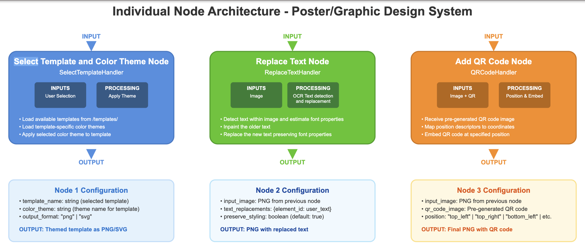

# Poster or Graphic Design OCR Project


*Individual Node Architecture - Poster/Graphic Design System*

This project provides tools for automated text detection, template management, and QR code overlay for poster or graphic design workflows. It is designed to help you quickly replace, theme, and enhance text in images and SVG templates, and to overlay QR codes on generated graphics.

## Features
- **OCR Text Detection**: Detects and extracts text regions from images using EasyOCR and heuristic font analysis.
- **Template Selection & Theming**: Select SVG templates and apply color themes, with automatic SVG-to-PNG conversion.
- **QR Code Overlay**: Overlay QR codes on images with flexible positioning, scaling, and opacity.
- **Organized Output**: All outputs are saved in an `output/` directory for easy access.

## Requirements
Install all dependencies with:
```bash
pip install -r requirements.txt
```

## Usage

### 1. OCR Text Detection & Replacement
Detect text and optionally replace text in an image:
```bash
python replace_text.py --input_image path/to/image.jpg --replacements_file my_replacements.json
```

### 2. Template Selection and Theming
Apply a theme to a template and convert to PNG:
```bash
python select_template.py --template_name business/flyer2 --theme_name blue --convert_to_png True
```

### 3. Overlay QR Code on Image
Overlay a QR code onto an image:
```bash
python overlay_qr_image_handler.py --image_path path/to/output.png --qr_image_path path/to/qr.png --position top_right --qr_scale 0.5 --opacity 0.9 --offset "(10,10)"
```
- `--offset` format: "(x,y)" or "x,y" (e.g., "(20,0)" for horizontal displacement)

## Directory Structure
```
Poster_or_Graphic_Design/
├── overlay_qr_image_handler.py
├── replace_text.py
├── select_template.py
├── requirements.txt
├── .gitignore
├── README.md
├── output/
├── templates/
│   ├── business/
│   ├── invitations/
│   ├── events/
│   └── themes/
└── samples/
```

## Tips
- All outputs (debug images, replaced images, themed SVG/PNGs, QR overlays) are saved in the `output/` folder.
- You can add new templates and themes in the `templates/` directory.
- The `.gitignore` is set up to keep your repository clean.
